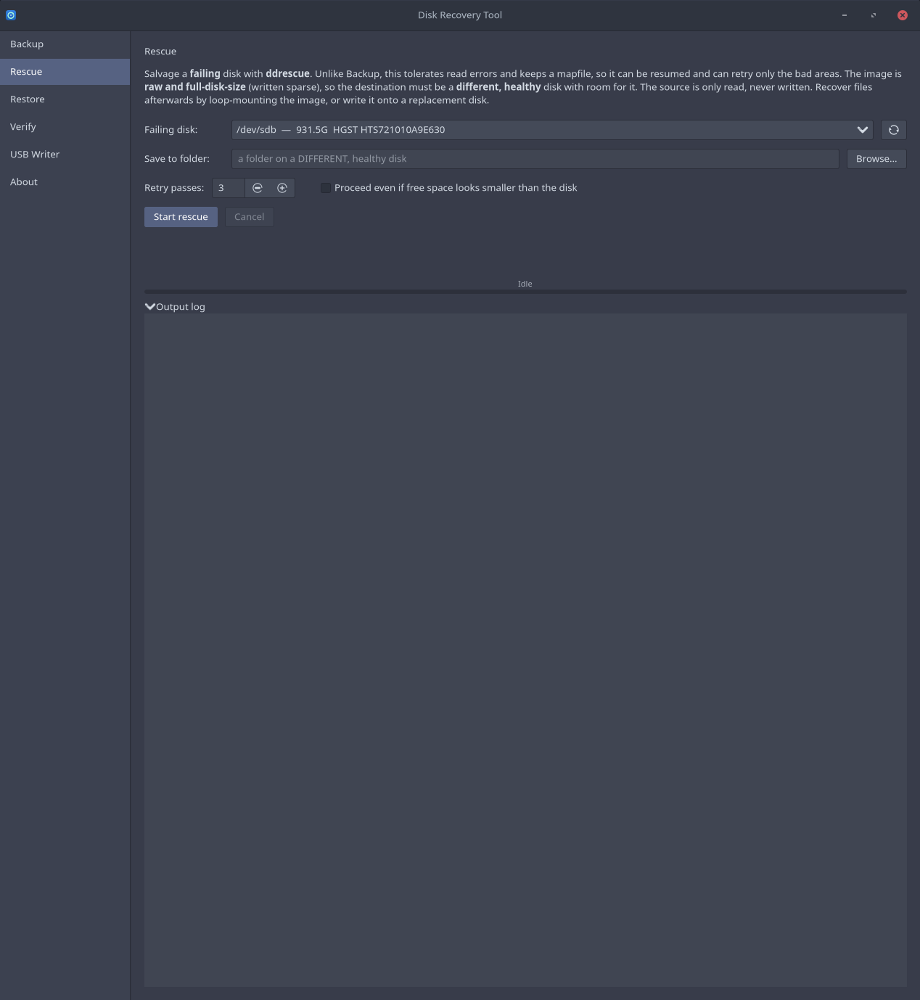
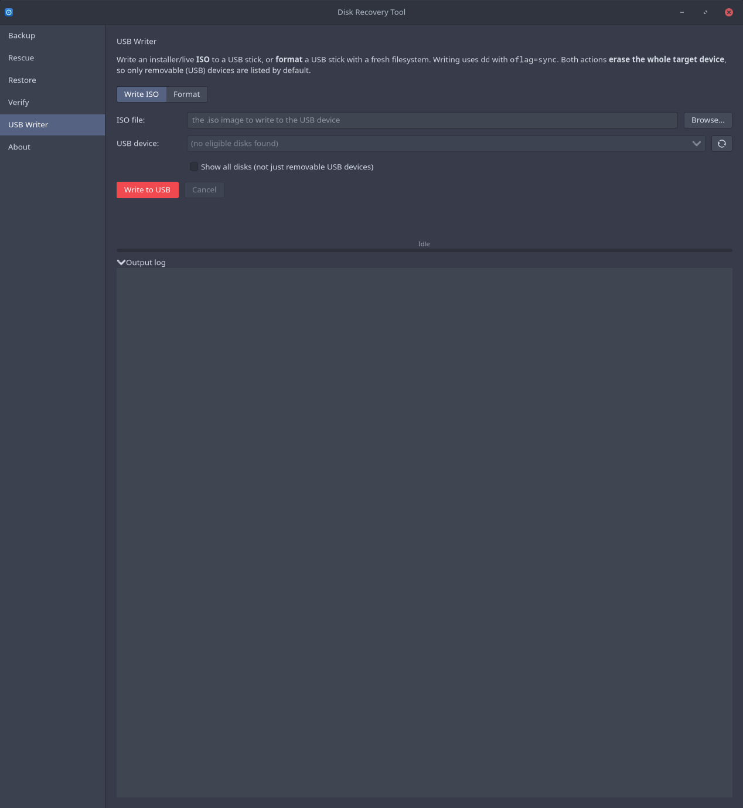

# Disk Recovery Tool

Whole-disk **backup and restore** for **Arch, Debian, and Fedora** (and their
derivatives), built on
[partclone](https://partclone.org) + [zstd](https://github.com/facebook/zstd),
with a GTK4 graphical front end styled after Erik Dubois' Arch Linux Tweak Tool.

It images only the **used blocks** of each filesystem (so a 1 TB disk that is
100 GB full produces ~100 GB, not 1 TB), preserves **btrfs snapshots and
subvolumes** and **filesystem UUIDs**, verifies every image with SHA-256, and can
grow the last partition onto a larger disk on restore. It also includes a
**USB Writer** for flashing an installer/live ISO to a USB stick or formatting
one. The GUI is a thin wrapper: every operation runs the same audited shell
scripts you can run from a terminal, so the GUI and CLI never drift apart.

> **Heads up:** restoring **erases the target disk**. It is guarded by a typed
> `ERASE` confirmation and a final dialog, and the backend refuses mounted disks
> and verifies checksums before writing anything.

---

## Features

- **Used-blocks-only imaging** with partclone (btrfs, ext4, vfat, exfat, xfs,
  ntfs, f2fs), raw `partclone.dd` fallback for anything else.
- **Complete, bit-exact backups** — all btrfs subvolumes and snapshots included.
- **zstd compression** with a selectable level.
- **SHA-256 verification** of every image, checked before any restore writes.
- **Verify a stored backup** at any time, without restoring — re-hashes every
  image against its recorded checksum (optional deep `zstd -t` decompress test).
- **SMART health pre-flight** — disk pickers flag a failing or aging drive
  (`smartctl`), warning you before you image off, or restore onto, bad media.
- **Rescue mode for failing disks** — when partclone can't read a dying drive,
  **ddrescue** salvages it to a raw image plus a mapfile, tolerating read errors
  and resumable to retry only the bad areas.
- **Restore to a same or larger disk**, optionally growing the last partition to
  fill the extra space.
- **Optional bootloader re-registration** (Limine / GRUB / systemd-boot) for
  restoring onto a different machine; same-machine restores boot via the existing
  EFI fallback with no extra step.
- **GTK4 GUI** with a live progress bar (parsed from partclone), a full log, and
  transient toast notifications on job completion, plus a CLI for scripting and
  rescue environments.
- **USB Writer** — write an installer/live **ISO** to a USB stick with `dd`
  (`oflag=sync`) and a live progress bar, or **format** a stick as FAT32, exFAT,
  NTFS, or ext4. Lists removable devices only by default and names the exact
  device in a confirmation dialog before it writes or formats.





## Repository layout

```
recovery-gui/        GTK4 application (launcher, src/, data/)
part_clone/          backend: partclone-backup.sh, partclone-restore.sh,
                     verify-backup.sh, ddrescue-rescue.sh,
                     usb-write.sh, usb-format.sh, self-tests
images/              screenshots used in the docs
install.sh           universal installer (Arch / Debian / Fedora)
PKGBUILD             Arch native package (-git)
disk-recovery-tool.install
LICENSE / NOTICE     GPL-3.0-or-later + credits
```

## Install

The universal installer works on **Arch, Debian, and Fedora** and their
derivatives. It reads `/etc/os-release`, installs the dependencies with your
distro's package manager (`pacman` / `apt` / `dnf`), and copies the application
into place.

```
git clone https://github.com/rcraig57/disk-recovery-tool.git
cd disk-recovery-tool
sudo ./install.sh
```

> Run the **installer** with `sudo` (it writes under `/usr` and installs
> packages). Do **not** run the application itself as root — the launcher
> elevates the whole app once via `pkexec`, and your desktop's polkit agent
> prompts for the admin password. partclone, losetup and mount all need root.

Afterwards launch **Disk Recovery Tool** from your application menu, or run
`recovery-tool`. To remove it: `sudo ./uninstall.sh`.

### Arch (native package)

On Arch and Arch-based distros you can equally use the PKGBUILD, which pulls the
dependencies and builds a tracked package:

```
git clone https://github.com/rcraig57/disk-recovery-tool.git
cd disk-recovery-tool
makepkg -si
```

## Use it from the terminal (no GUI / rescue environment)

The scripts in `part_clone/` are standalone. Back up `/dev/sdX` to a folder:

```
sudo ./part_clone/partclone-backup.sh /dev/sdX /mnt/storage
```

Restore a backup folder onto a target disk (this erases it):

```
sudo ./part_clone/partclone-restore.sh /mnt/storage/HOST-img-YYYYMMDD-HHMMSS /dev/sdX
```

Both are interactive by default and accept flags for unattended use
(`--yes`, `--erase`, `--grow`/`--no-grow`, `--bootloader`/`--no-bootloader`,
`--no-reboot`). The source disk for a backup must be unmounted — image a disk you
did **not** boot from (e.g. from a live USB, or a second drive).

Verify a stored backup without restoring it (re-hashes every image; `--deep`
adds a `zstd -t` decompress test):

```
./part_clone/verify-backup.sh --deep /mnt/storage/HOST-img-YYYYMMDD-HHMMSS
```

Rescue a failing disk to an image + mapfile with ddrescue (save it to a
**different**, healthy disk):

```
sudo ./part_clone/ddrescue-rescue.sh --yes /dev/sdX /mnt/storage
```

The USB Writer scripts are standalone too. Write an ISO to a USB device:

```
sudo ./part_clone/usb-write.sh --yes /path/to/image.iso /dev/sdX
```

Format a USB device (FAT32 / exFAT / NTFS / ext4):

```
sudo ./part_clone/usb-format.sh --yes --fs fat32 --label "USB STICK" /dev/sdX
```

Both ERASE the whole target device and refuse a device holding the running
system.

## How it works

`partclone-backup.sh` writes, per partition: a compressed image
(`partclone.<fs> -c | zstd`), a `.sha256`, the GPT/MBR layout (`sfdisk -d`), a
manifest, and metadata. `partclone-restore.sh` verifies all checksums, recreates
the partition table, restores each image, optionally grows the last partition,
and optionally re-registers the bootloader in a chroot. Because images are
block-exact and UUIDs are preserved, the restored system's `fstab` and bootloader
command line already match.

## Dependencies

`python` `python-gobject` `gtk4` `partclone` `zstd` `util-linux` `gptfdisk`
`parted` `btrfs-progs` `e2fsprogs` `dosfstools` `exfatprogs` `ntfs-3g`
`coreutils` `smartmontools` `ddrescue` `polkit`. Four serve the USB Writer:
`dosfstools` (`mkfs.fat`/FAT32), `exfatprogs` (`mkfs.exfat`), `ntfs-3g`
(`mkfs.ntfs`), and `coreutils` (`dd`, `stdbuf`); `e2fsprogs` covers `mkfs.ext4`.
`smartmontools` (`smartctl`) powers the SMART pre-flight and `ddrescue` powers
Rescue mode (on Debian/Ubuntu that package is **`gddrescue`**). Optional:
`xorg-xhost` (to run the GUI as root under X11/XWayland), `limine`/`grub`
(bootloader re-registration). The PKGBUILD declares all of these.

`install.sh` resolves these automatically per distro; the names above are the
Arch set (Debian/Fedora equivalents are mapped inside the installer).

## Credits & license

Engine: **partclone** (GPL-2.0-or-later). GUI look/feel and launcher modelled on
**Erik Dubois' Arch Linux Tweak Tool** (GPL-3.0). See `NOTICE` for full credits.

Licensed under **GPL-3.0-or-later** — see `LICENSE`.
